# Спецпроцессоры: обзор вводной литературы

Здесь приведены источники для начального знакомства с вопросами проектирования и программирования спецпроцессоров. Предпочтение отдано обзорным работам и учебникам, которые произвели на меня наибольшее впечатление.

## 1. Почему спецпроцессоры важны

### Implications of Makimoto’s Wave

Статья доступна [онлайн](https://www.shmj.or.jp/makimoto/pdf/makimoto_04_01.pdf).

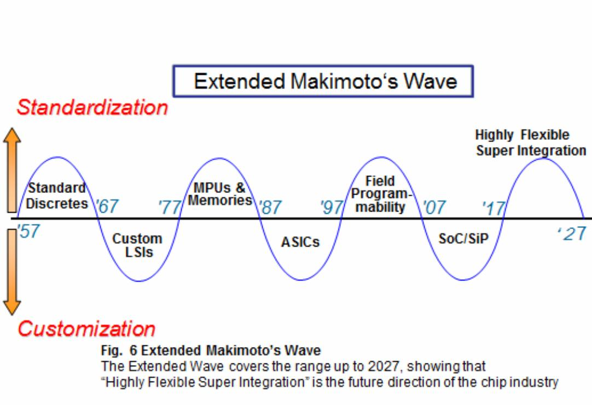

Волна (или маятник) Макимото демонстрирует, что интерес в микроэлектронике колеблется между специализированными решениями и решениями общего назначения. К примеру, в области игрового "железа" можно выделить несколько этапов: специализированные чипы для обработки 2d графики, программный доступ к экранному буферу, специализированные ускорители для 3d, вычисления общего назначения на графических процессорах. Судя по всему, потребность в высокоуровневой специализации останется, даже если в ближайшем будущем произойдет полный переход на FGPA-подобные однородные структуры или универсальный "программируемый кремний".

### Жизнь в эпоху «тёмного» кремния

Статья доступна [онлайн](https://habr.com/ru/companies/intel/articles/158223/).

Почему сегодня маятник Макимото склонился в сторону специализации вычислений? Разве нельзя просто продолжать увеличивать тактовую частоту, как в старые-добрые времена, или же наращивать число процессорных ядер общего назначения? Ответ: "темный кремний".

### A new golden age for computer architecture

Видео доступно [онлайн](https://engineer.yadro.com/video/new-golden-age-of-computer-architecture/).
Более ранняя статья доступна [онлайн](https://dl.acm.org/doi/pdf/10.1145/3282307).

Знаменитые тьюринговские лауреаты, Паттерсон и Хеннесси, рассказывают, почему переход к предметно-ориентированным архитектурам (domain-specific architectures, DSAs) является исторически закономерным.

## 2. Об архитектурах

### Компьютеры на СБИС

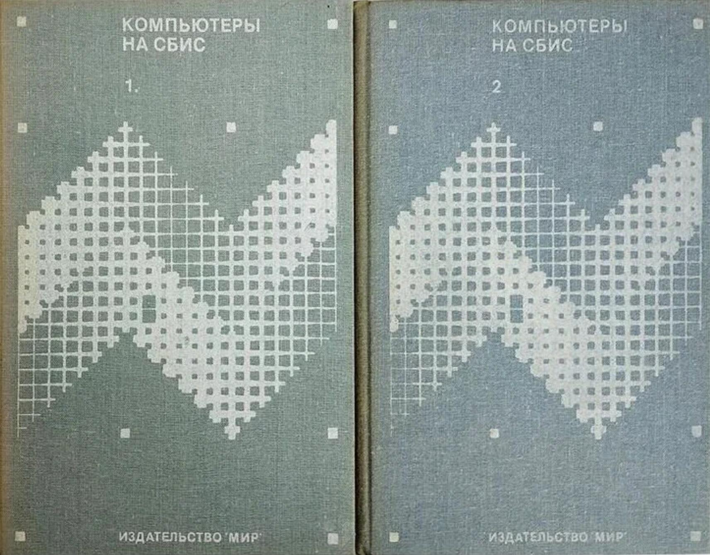

Этот двухтомник японских авторов (оригинал вышел в далеком 84-м!) пробудил у меня в свое время интерес к специализированным вычислениям. Многие процессорные архитектуры из этих книг до сих пор выглядят вполне передовыми: машины, управляемые потоком данных, редукционные машины, специализированные ЦОС-процессоры, машины для обработки символов, машины реляционной алгебры и так далее.

### Матричные процессоры на СБИС

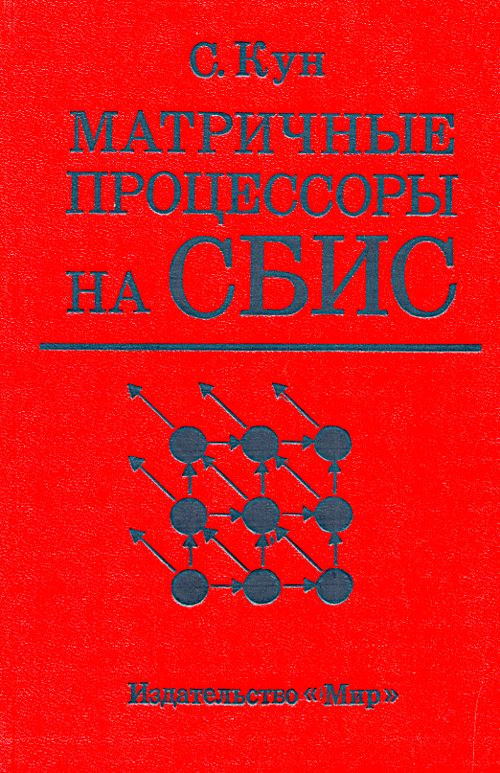

Книга С. Куна (оригинал вышел в 88-м году) о проектировании систолических массивов и волновых процессоров. Кун, кстати говоря, является одним из авторов систолических архитектур. Какое это имеет отношение к дню сегодняшнему? Архитектура современного ускорителя Google TPU тоже представляет собой систолический массив.

### Stack Computers: the new wave

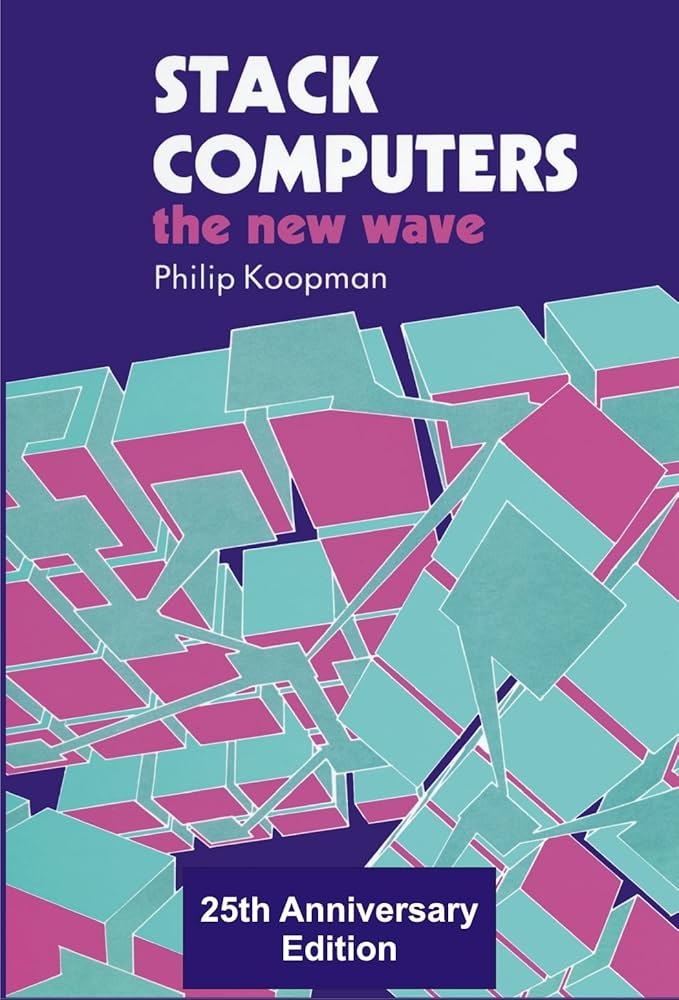

Книга доступна [онлайн](https://users.ece.cmu.edu/~koopman/stack_computers/index.html).

Еще одна старая книга (89-й год), на этот раз о стековых архитектурах. Точнее говоря, об их новой волне: форт-процессорах. Характерное применение форт-процессора: радиационно-стойкий чип RTX2010 в системе управления спускаемым аппаратом межпланетной станции "Розетта". Меня же с языком Форт и форт-процессорами связывает многое, см. далее.

### Embedded Computing: A VLIW Approach to Architecture, Compilers and Tools

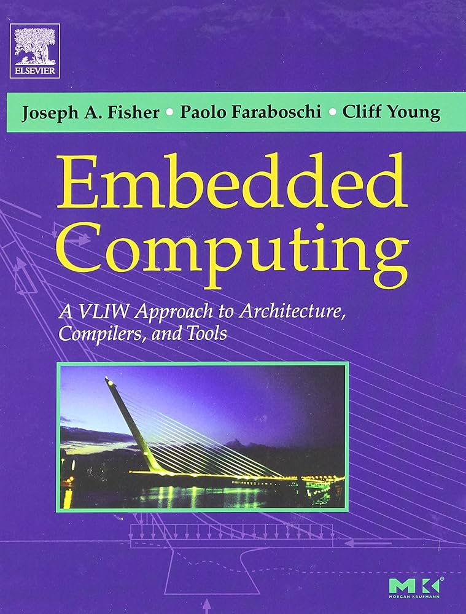

Ссылка на [Amazon](https://www.amazon.com/Embedded-Computing-Approach-Architecture-Compilers/dp/1558607668).

Считается, что автор книги, J. Fisher, и придумал VLIW. В реальности у архитектуры были и иные авторы, см. мою заметку [Вектор-инструкция: о советском происхождении VLIW](https://habr.com/ru/articles/573306/). В любом случае, книга вполне подходит для изучения архитектуры VLIW-процессоров в контексте специализированных вычислений.

### Microprocessor Architectures: From VLIW to TTA

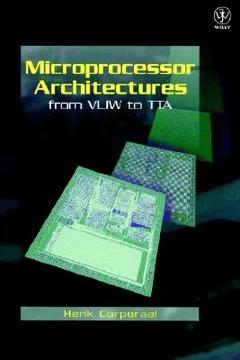

Ссылка на [Amazon](https://www.amazon.com/Microprocessor-Architectures-Wiley-Microwave-Optical/dp/047197157X).

Книга от Henk Corporaal, который является архитектуры TTA. Книгу, к слову сказать, интересно читать, даже если нет особенного интереса к VLIW и TTA. В этом смысле заслуживает внимания 2-я глава под названием "Тенденции в компьютерной архитектуре" (эту главу можно найти в интернете).

### Parallel Computer Organization and Design

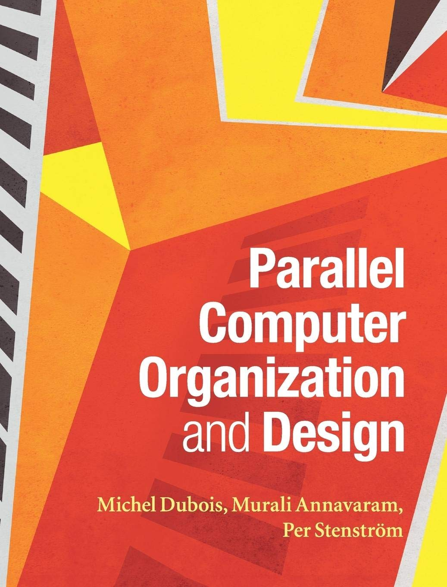

Ссылка на [Amazon](https://www.amazon.com/Parallel-Computer-Organization-Design-Professor/dp/0521886759).

Неплохой учебник о параллельных архитектурах. На мой взгляд, материал здесь излагается лучше, чем в знаменитой Computer Architecture: A Quantitative Approach.

### Domain-Specific Hardware Accelerators

Статья доступна [онлайн](https://cacm.acm.org/research/domain-specific-hardware-accelerators/).

Обзорная статья о DSA. Что, как и на каком уровне аппаратно ускорять, как проектировать такие ускорители.

## 3. Вопросы проектирования

### Hints for Computer System Design

Статья доступна [онлайн](https://www.microsoft.com/en-us/research/wp-content/uploads/2016/02/acrobat-17.pdf).

Советы по проектированию компьютерных систем от еще одного тьюринговского лауреата, Батлера Лэмпсона. Лишь часть этих советов относится к проектированию аппаратной части, но ведь проектировать аппаратуру разумно совместно с программной частью компьютерной системы. Более поздняя версия статьи, где упор делается на формальные спецификации, доступна [онлайн](https://arxiv.org/pdf/2011.02455).

### Оркестр играет без дирижера. Размышления об эволюции некоторых технических систем и управлении ими

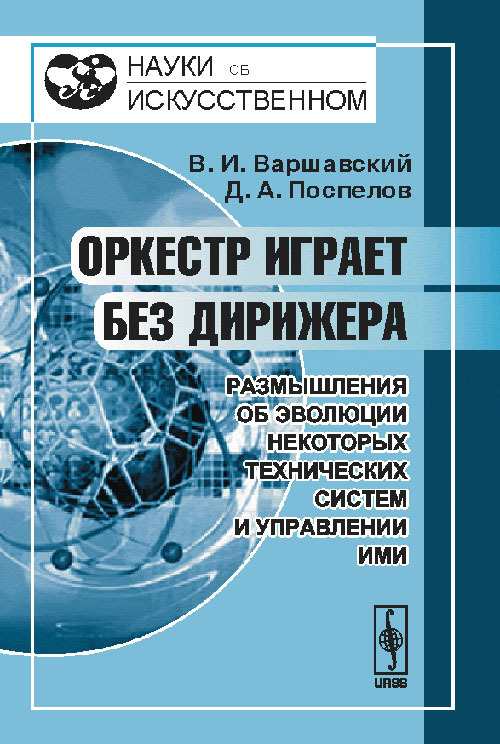

Ссылка на [издательство](https://urss.ru/cgi-bin/db.pl?lang=Ru&blang=ru&page=Book&id=45524).

Научно-популярная книга (оригинал вышел в 1984-м году) о децентрализованных, синхронных и асинхронных системах. Один из ее авторов, Д. А. Поспелов, специалист в области искусственного интеллекта и автор ярусно-параллельной формы. Другой автор, В.И. Варшавский, один из крупнейших специалистов в области асинхронной логики. Децентрализация и асинхронность – среди наиболее перспективных подходов к проектированию энергоэффективных спецпроцессоров.

### Embedded System Design

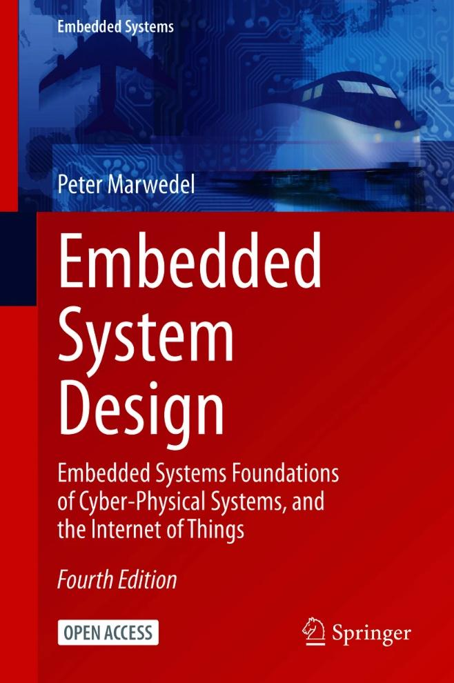

Книга доступна [онлайн](https://link.springer.com/book/10.1007/978-3-030-60910-8).

Книга от одной из ключевых фигур в области программно-аппаратного проектирования (hw/sw codesign) – P. Marwedel. Это хорошо спроектированный учебник, который затрагивает все основные аспекты проектирования встраиваемых систем, то есть тех систем, где особенно часто используются спецпроцессоры.

### ПЛИС Xilinx. Языки описания аппаратуры VHDL и Verilog, САПР, приемы проектирования

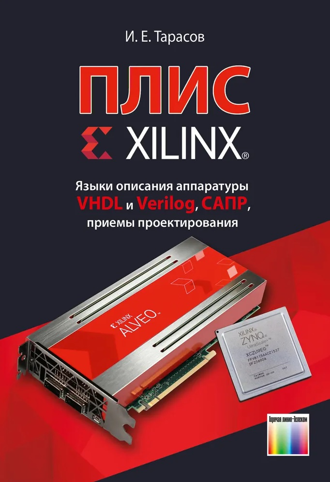

Ссылка на [издательство](https://www.techbook.ru/book.php?id_book=1082).

Учебник И.Е. Тарасова, моего коллеги и научного руководителя. Упор на использование FPGA неслучаен – именно таким образом разрабатываются многие спецпроцессоры.

### Специализированные процессоры ASIP и способы их верификации

Статья доступна [онлайн](https://www.electronics.ru/files/article_pdf/8/article_8744_872.pdf).

Единственная статья на русском языке, описывающая уникальный инструмент ASIP Designer компании Synopsys. Этот инструмент предзначен для автоматизации проектирования спецпроцессоров: по высокоуровневому описанию автоматически строится RTL-модель, компилятор и симулятор.

### Customizable Embedded Processors: Design Technologies and Applications

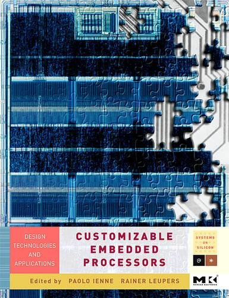

Ссылка на [Amazon](https://www.amazon.com/Customizable-Embedded-Processors-Technologies-Applications/dp/0123695260).

Лучшая, на мой взгляд, книга об автоматизации проектирования спецпроцессоров. Здесь, помимо прочего, представлены детали устройства ранней версии ASIP Designer. Кроме того, описан еще более передовой подход к проектированию: с использованием автоматического синтеза специализированных команд.

### Аппаратная компиляция: синтез специализированных ускорителей

Видео доступно [онлайн](https://www.youtube.com/watch?v=Q6-h6R_e-04).

В докладе показаны некоторые мои наработки по теме автоматизации проектирования спецпроцессоров.

## 4. Вопросы программирования

### Engineering a Compiler

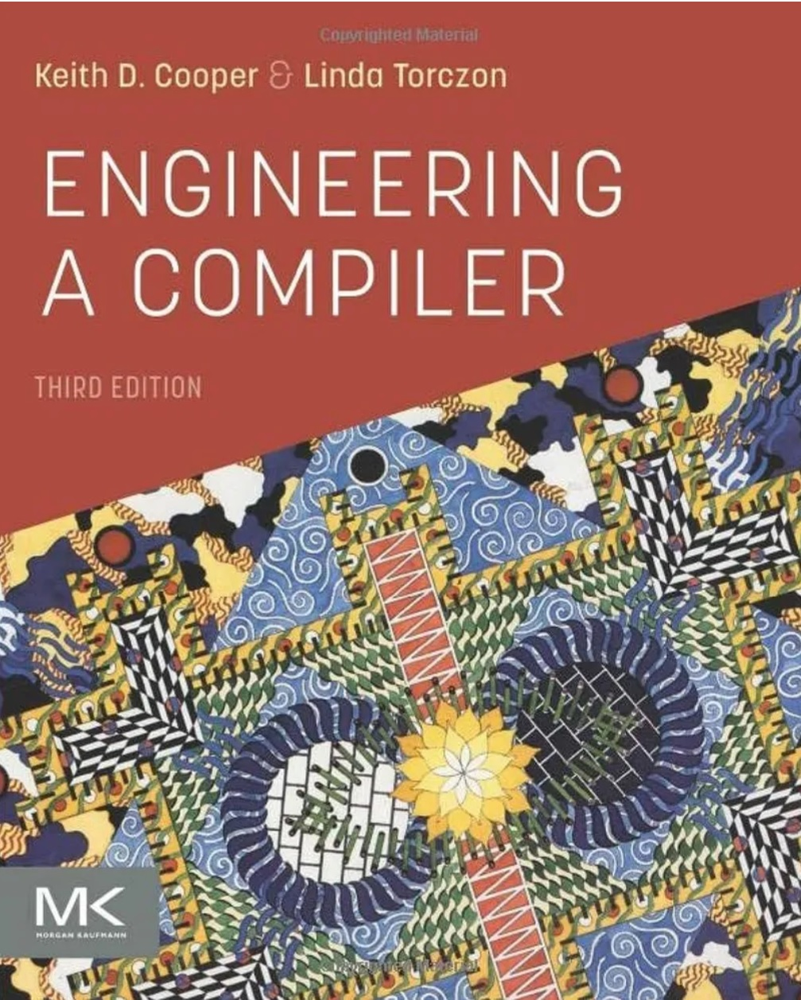

Ссылка на [издательство](https://shop.elsevier.com/books/engineering-a-compiler/cooper/978-0-12-815412-0).

В отсутствие учебника по разработке DSL-компиляторов для спецпроцессоров приходится читать обычные учебники по компиляторам. Книга Cooper и Toczon выделяется среди таковых хорошим стилем изложения и широким охватом материала. "Книга Дракона", на мой взгляд, серьезно ей проигрывает. Это неслучайно, ведь K. Cooper – известный теоретик компиляторостроения.

### Reasoning About Program Transformations

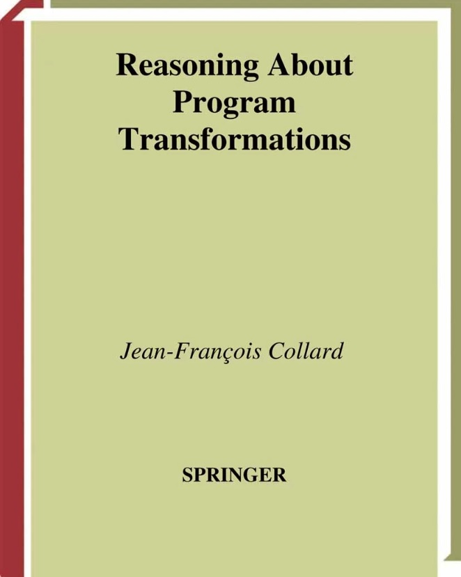

Ссылка на [издательство](https://link.springer.com/book/10.1007/b97654).

Эта небольшая (236 c.) и малоизвестная книга посвящена статическому анализу и преобразованиям программ, от формы SSA и до полиэдральных представлений. Весьма увлекательное чтение!

### Optimizing Compilers for Modern Architectures

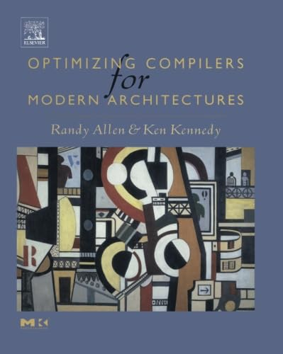

Книга в [издательстве](https://www.amazon.com/Optimizing-Compilers-Modern-Architectures-Dependence-based/dp/1558602860).

Классический учебник по основам распараллеливания и оптимизации циклов. Только надо учитывать, что с 2001-го года прогресс в этой области на месте не стоял.

### SSA-based Compiler Design

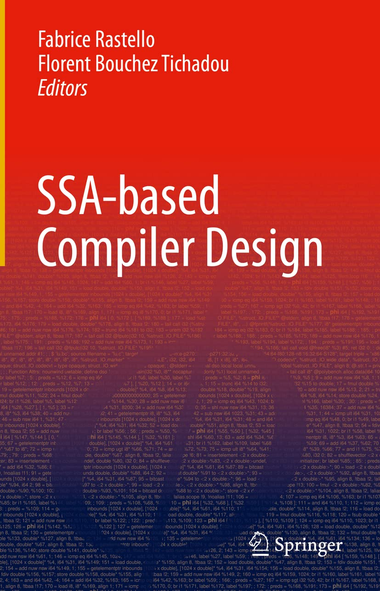

Ссылка на [издательство](https://link.springer.com/book/10.1007/978-3-030-80515-9).

Отличный современный источник информации о вариантах SSA-представления и его прикладных применениях.

### Instruction Selection: Principles, Methods, and Applications

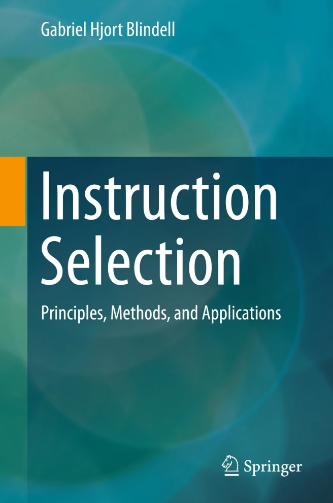

Книга доступна [онлайн](https://www.diva-portal.org/smash/get/diva2:951540/FULLTEXT01.pdf).

При разработке компилятора для спецпроцессора особое внимание обычно приходится уделять генератору кода. В этом отношении очень хорошо, что есть книга, в которой описаны основные подходы к реализации выбора команд. Ведь команды в спецпроцессоре могут быть весьма замысловатыми!

### Instruction Level Parallelism

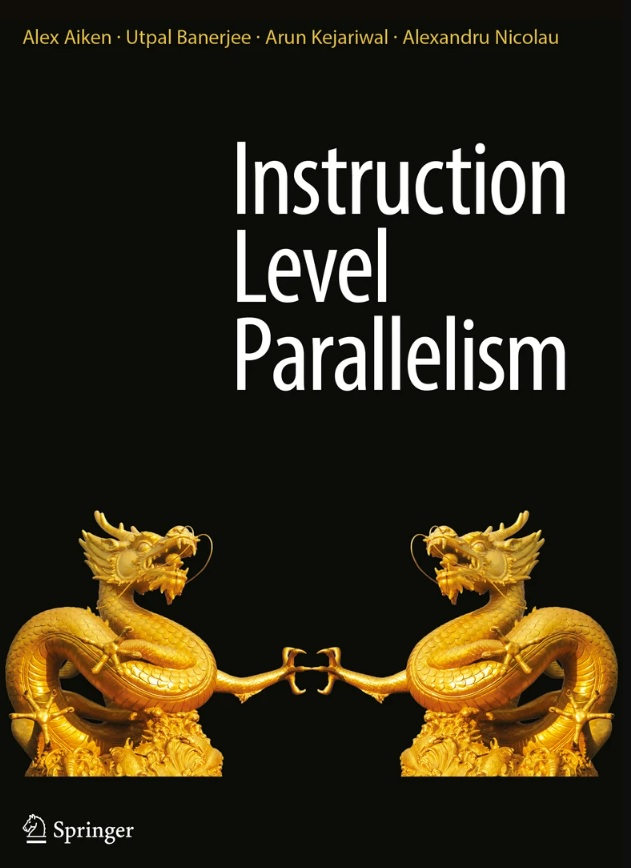

Ссылка на [издательство](https://link.springer.com/book/10.1007/978-1-4899-7797-7).

Еще один важный для спецпроцессоров аспект генерации кода – выявление статического параллелизма уровня команд. К слову сказать, один из авторов книги, А. Aiken, является достаточно известным в компиляторном мире специалистом.

### Richard Feynman and The Connection Machine

Статья доступна [онлайн](https://longnow.org/essays/richard-feynman-connection-machine/).

Это воспоминания о том, как знаменитый физик Р. Фейнман принимал участие в проекте по созданию и применению специализированного суперкомпьютера Connection Machine. Некоторые моменты мне очень близки и понятны по проектам в духе SEAforth (см. далее).

### Программирование мультикомпьютеров на кристалле семейства SEAforth

Статья доступна [онлайн](http://sovietov.com/txt/seaforth/seaforth.html).

Написано по мотивам  моей работы в компании IntellaSys, совместно с автором языка Форт, Чаком Муром. Проект был довольно безумный: многоядерный, матричный форт-процессор без общей памяти, с взаимодействием по модели CSP. Игроки в TIS-100 должны примерно понять, о чем идет речь. За рамками статьи остался разработанные мной супероптимизатор и [инструмент отображения графа программы на матрицу процессорных элементов](http://sovietov.com/app/mapper/mapper_demo.html).

### Математическое и алгоритмическое обеспечение создания компиляторов предметно-­ориентированных языков для специализированных вычислительных машин

Диссертация доступна [онлайн](https://www.mirea.ru/upload/medialibrary/72e/Sopetov_dissertation.pdf).

Моя кандидатская диссертация по вопросам автоматизации создания генераторов кода для спецпроцессоров. Основная идея: реализовывать фазы генерации кода, по возможности, совместно, формулируя соответствующие задачи декларативным образом и переводя их на язык SMT-решателя.

### Создание компиляторов для спецпроцессоров

Видео доступно [онлайн](https://www.youtube.com/watch?v=1m8oAQCTSeY).

Моя лекция для компиляторщиков Samsung R&D. Название говорит само за себя.
